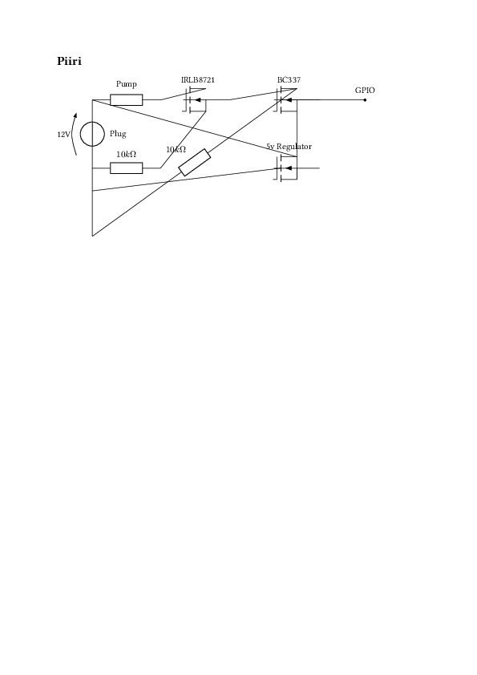

# Automatic BAC optimizer

This system promises you the optimal BAC for every party. It is implemented with the circuit described in the picture bellow. The GPIO pin is connected to Rasberry Pi 4B that runs the code in this repository over Docker.

